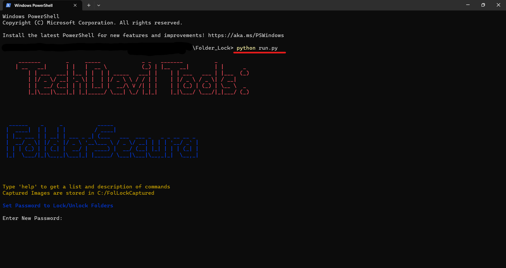
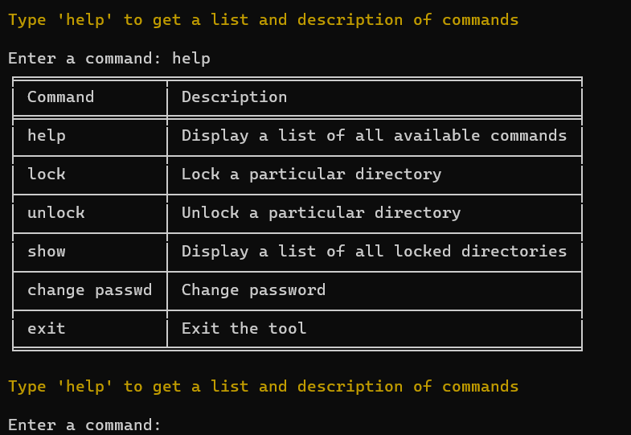

# FolderSecura

Introducing FolderSecura, the ultimate privacy solution for Windows users. With FolderSecura, you can confidently protect your sensitive folders by hiding them from prying eyes. This powerful tool allows you to conceal specific folders on your computer, making them completely invisible to unauthorized users. But it doesn't stop there. FolderSecura takes security to the next level by providing robust password protection. You can set a strong password of your choice, ensuring that only authorized individuals can access the hidden folders. This added layer of security ensures the confidentiality and integrity of your important files. FolderSecura offers a CLI, making it easy to hide and protect your folders with just a few commands. Once hidden, the folders become inaccessible to anyone who doesn't have the correct password. Rest assured, FolderSecura has your back even if someone attempts unauthorized access. If an intruder enters an incorrect password three times, FolderSecura activates your computer's webcam to capture a snapshot of the perpetrator. This feature serves as a powerful deterrent and provides you with visual evidence of any unauthorized access attempts. Whether you need to safeguard personal documents, confidential work files, or any other sensitive data, FolderSecura is the ideal tool for ensuring your privacy and maintaining the security of your hidden folders. With FolderSecura, you can have peace of mind knowing that your confidential information remains protected, while the built-in webcam capture feature adds an extra layer of security against unauthorized access.

## Table of Contents

- [Installation](#installation)
- [Usage](#usage)
- [Features](#features)
- [Contact Me](#contact-me)

## Installation

To get a local copy of this project, you can clone it using Git. Follow the steps below:

1. Open Command Prompt.
2. Change the current working directory to the location where you want the cloned directory to be saved.
3. Run the following command to clone the repository:

   ```shell
   git clone https://github.com/omsahare-14/FolderSecura/
   ```
4. After executing the command, the repository will be cloned to your local machine.

Now you have a local copy of the project to work with.

## Usage

To run this tool, open 'run.py' file in CMD. If you're opening it for the first time, it'll ask you to set a Password and Recovery Question/Answer.
   
   ```shell
   python run.py
   ```


Run the 'help' command to view all the available commands. Type any one of the commands and follow the on-screen instructions to use that command



## Features

- Password Protection: All your folders/files are password protected. The password are stored in secure manner to prevent password theft in any manner.
- Webcam Security: If someone enters incorrect password for 3 times, their snapshot is captured by the webcam to later identify the perpetrator.
- Hide Folder: All your sensitive and secret data stored inside the folder is hidden in a secure manner to prevent data theft.

## Contact Me

If you have any questions, feedback, or suggestions, feel free to reach out to me.

- Email: [omsahareofficial@gmail.com](mailto:omsahareofficial@gmail.com)
- LinkedIn: [om-sahare-253b30207/](https://www.linkedin.com/in/om-sahare-253b30207/)
- Twitter: [@omsahare14](https://twitter.com/omsahare14)
